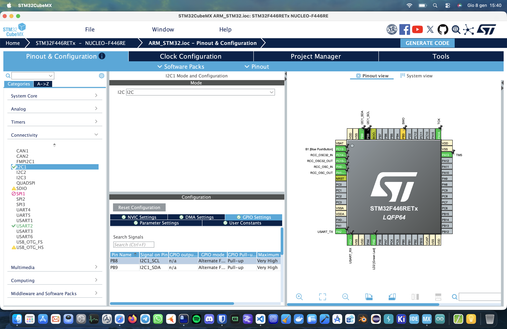

# ROBOTIC ARM WITH STM32 NUCLEO F446RE 

## HARDWARE

To start this project you need hardware components :

    - Stm32 nucleo F446RE 
    - PWM servo driver shield I2C PCA9685
    - Power supply output 6 A and 5 V or 6 V
    - 6 DOF Robotic Mechanical ARM with servos :
        - you can buy the kit from aliexpress or using 3d print for the chassis
        - if you want to buy servos the one that i m using MG996R can spin only for 180 degrees
        

    
## Optional : 

Breadboard with 6 buttons to control the spin of the servos othwerise you can control it with the code by the main.c but you ll have to write it.

## Video of robotic arm :

## How to configure the Hardware :

## How to start the project Software: 

First of all you need to download STM32CubeMX. Once you downloaded it, you can chose file -> new project -> board selector and in this part inside the field "Commercial Part number" you type the F446RE than you select the board and click start project.

In Pinout & Configuration is very important to select Connectivity , I2C1 , on the field disable put I2C, select GPIO settings ( under the board) select PB8 and PB9 as GPIO Pull UP. Once u done that u type generate code and it will make the folder of the name of the project.

Than you go to VS code , download the extension STM32cube_for_visual_studio_code is very important to accept the notification that will pop up for the debugging and is important that we use as debugger the ST-Link server. 

Once you done all of that we can start building our code in the Core/Src/main.c

### CODE OF SERVO / BUTTONS : 

## FUTURE PROJECT : USING A GLOVE TO CONTROL THE ARM 

